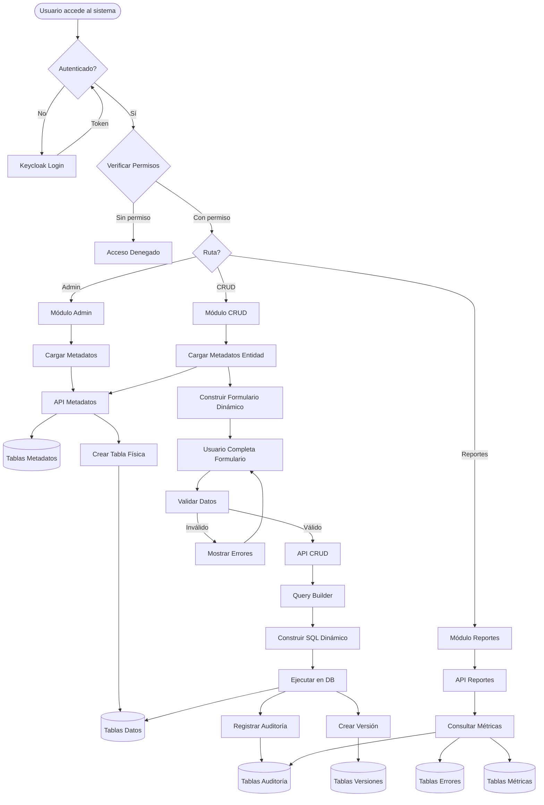
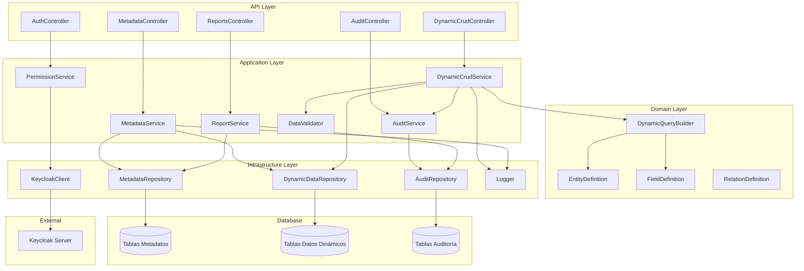
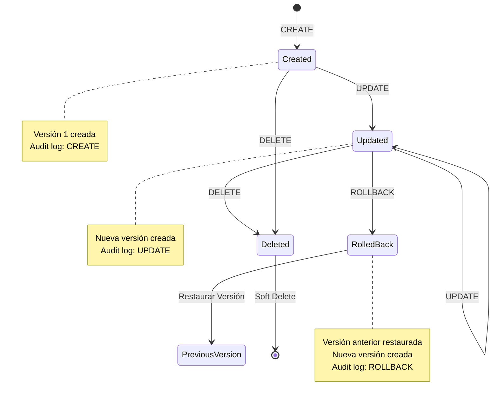
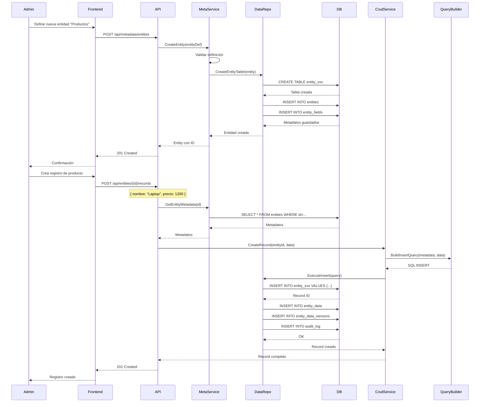
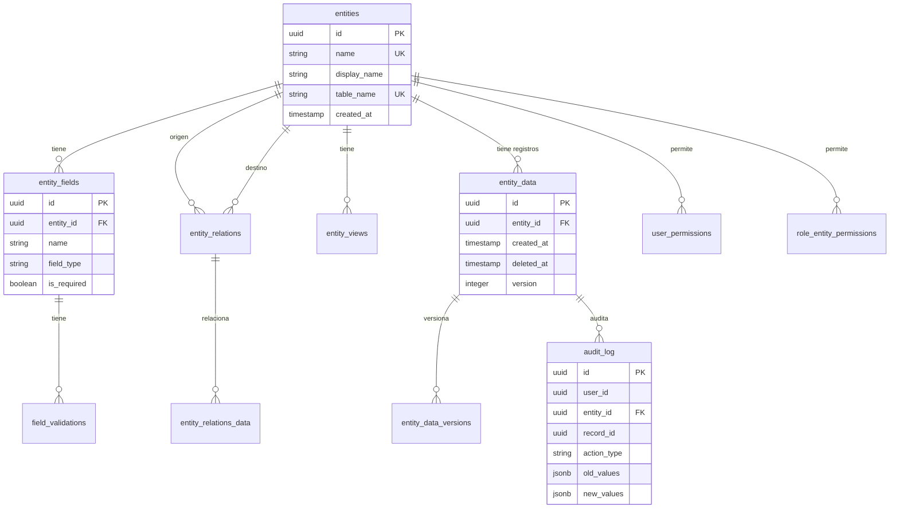
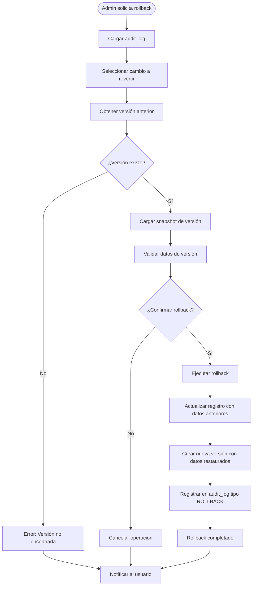
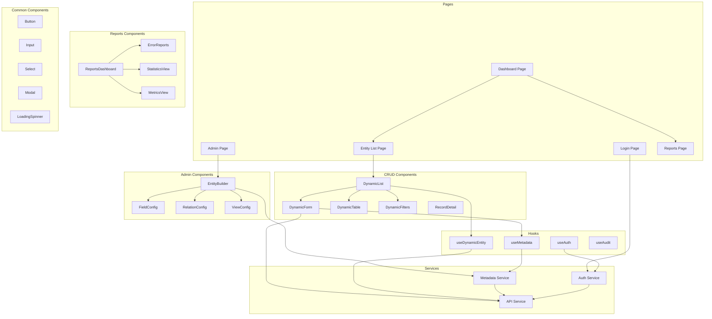
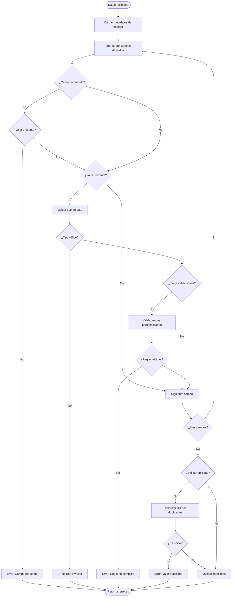

# Diagramas Detallados

Este documento contiene diagramas adicionales y más detallados del sistema.

## 1. Diagrama de Flujo de Datos - Sistema Completo

## 2. Diagrama de Componentes - Backend Detallado

## 3. Diagrama de Estados - Ciclo de Vida de un Registro

## 4. Diagrama de Secuencia - Proceso Completo de Creación de Entidad y Registro

## 5. Diagrama de Arquitectura de Datos

## 6. Diagrama de Flujo - Proceso de Rollback

## 7. Diagrama de Componentes - Frontend Detallado

## 8. Diagrama de Flujo - Validación de Datos

Estos diagramas complementan la documentación principal y ayudan a visualizar mejor los diferentes aspectos del sistema.

