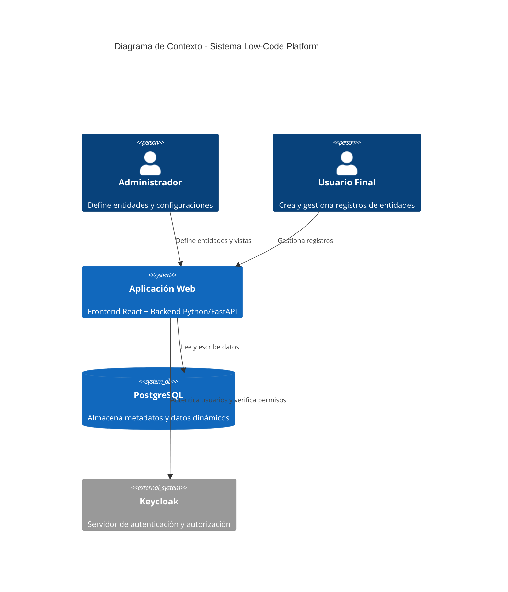
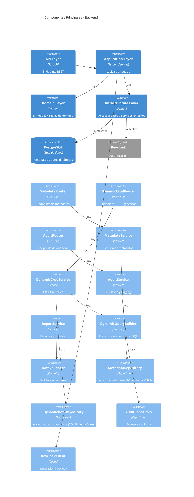
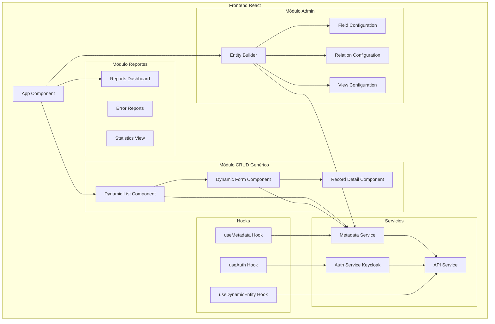
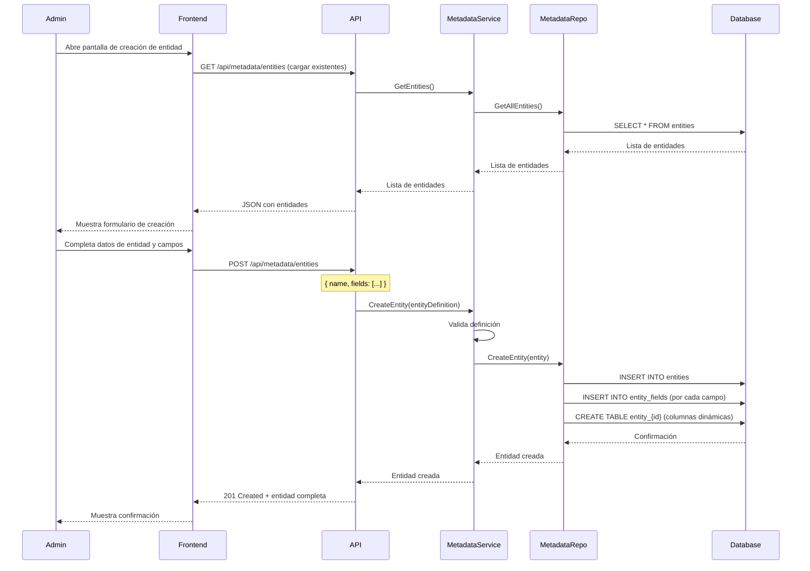
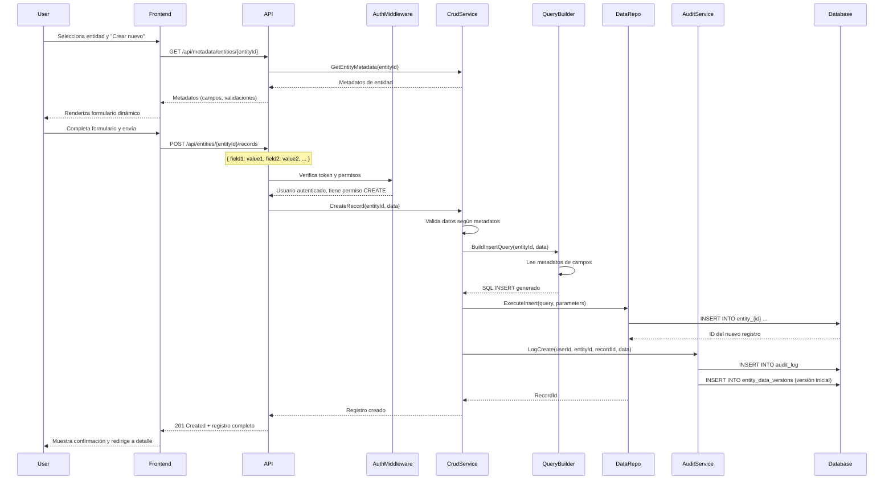
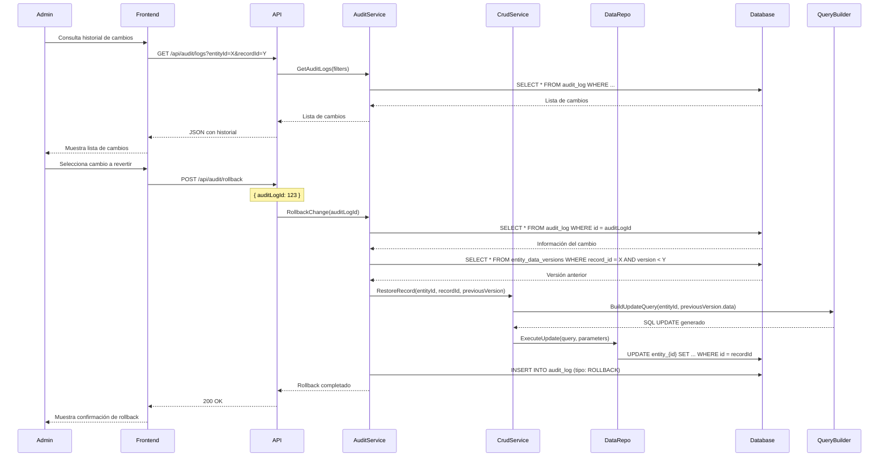
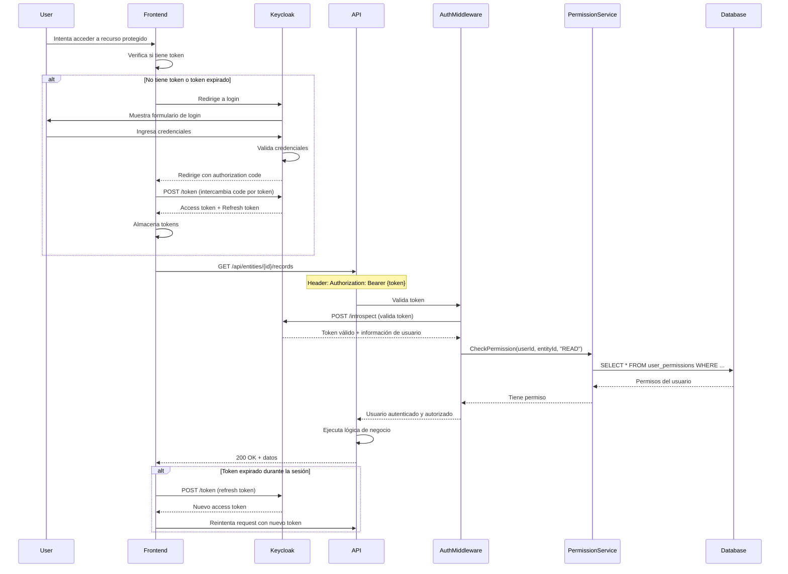

# Sistema Low-Code Platform - Documentación de Diseño

## 1. Validación y Resumen del Problema

### 1.1 Entendimiento del Sistema

El sistema es una **plataforma administrativa basada en metadatos** que permite a los administradores definir entidades de negocio dinámicamente sin necesidad de modificar código. Los usuarios finales pueden crear, leer, actualizar y eliminar registros de estas entidades a través de interfaces generadas automáticamente.

**Características principales:**
- Definición dinámica de entidades, campos, relaciones y vistas desde una interfaz administrativa
- CRUD genérico que funciona para cualquier entidad configurada
- Sistema de auditoría completo con bitácoras de cambios
- Mecanismo de rollback para revertir cambios recientes
- Reportes y métricas del sistema
- Autenticación y autorización basada en Keycloak
- Arquitectura extensible para futuras reglas de negocio

### 1.2 Arquitectura Basada en Metadatos

La arquitectura propuesta utiliza un **modelo de metadatos** donde:

1. **Metadatos de definición**: Se almacenan en tablas especiales que describen entidades, campos, relaciones y vistas
2. **Datos dinámicos**: Se almacenan en tablas genéricas o tablas creadas dinámicamente según la configuración
3. **Motor de ejecución**: Un motor genérico interpreta los metadatos para generar consultas SQL dinámicas y construir respuestas
4. **Frontend dinámico**: El frontend consume los metadatos para renderizar formularios y listados automáticamente

**Ventajas:**
- No requiere recompilación para nuevas entidades
- Escalable y mantenible
- Permite cambios rápidos sin tocar código
- Base sólida para extensibilidad futura

---

## 2. Propuesta de Arquitectura General

### 2.1 Tipo de Arquitectura

Se propone una **Arquitectura en Capas con separación de responsabilidades**, combinada con principios de **Clean Architecture**:

```
┌─────────────────────────────────────────┐
│         Frontend (React)                │
│  - Componentes genéricos                │
│  - Admin de metadatos                   │
│  - CRUD dinámico                        │
└─────────────────┬───────────────────────┘
                  │ HTTP/REST
┌─────────────────▼───────────────────────┐
│      API Layer (FastAPI)                │
│  - Routers genéricos                    │
│  - Validación con Pydantic              │
│  - Autenticación/Authorización           │
└─────────────────┬───────────────────────┘
                  │
┌─────────────────▼───────────────────────┐
│    Application Layer (Services)         │
│  - MetadataService                      │
│  - DynamicCrudService                   │
│  - AuditService                         │
│  - ReportService                        │
└─────────────────┬───────────────────────┘
                  │
┌─────────────────▼───────────────────────┐
│      Domain Layer (Core Business)       │
│  - Entidades de dominio                 │
│  - Lógica de metadatos                  │
│  - Validadores                          │
└─────────────────┬───────────────────────┘
                  │
┌─────────────────▼───────────────────────┐
│    Infrastructure Layer (Data Access)   │
│  - MetadataRepository (SQLAlchemy ORM) │
│  - DynamicDataRepository (SQLAlchemy Core)│
│  - AuditRepository                      │
│  - KeycloakClient                       │
└─────────────────┬───────────────────────┘
                  │
┌─────────────────▼───────────────────────┐
│         PostgreSQL Database             │
│  - Tablas de metadatos                  │
│  - Tablas de datos dinámicos            │
│  - Tablas de auditoría                  │
└─────────────────────────────────────────┘
```

**Justificación:**
- Separación clara de responsabilidades
- Facilita testing y mantenimiento
- Permite intercambiar implementaciones (ej: cambiar de PostgreSQL a otro DB)
- Escalable y profesional

### 2.2 Módulos Principales

#### 2.2.1 Módulo de Metadatos
**Responsabilidad**: Gestionar la definición de entidades, campos, relaciones y vistas.

**Componentes:**
- `EntityDefinitionService`: Crear/editar/eliminar entidades
- `FieldDefinitionService`: Gestionar campos de entidades
- `RelationDefinitionService`: Gestionar relaciones entre entidades
- `ViewDefinitionService`: Gestionar configuraciones de vistas (listados, formularios)

#### 2.2.2 Módulo de Ejecución CRUD Genérico
**Responsabilidad**: Ejecutar operaciones CRUD sobre cualquier entidad definida en metadatos.

**Componentes:**
- `DynamicQueryBuilder`: Construye consultas SQL dinámicas basadas en metadatos
- `DynamicCrudService`: Orquesta las operaciones CRUD
- `DataValidator`: Valida datos según reglas de metadatos
- `RelationshipHandler`: Maneja relaciones 1-1, 1-n, n-n

#### 2.2.3 Módulo de Logging y Auditoría
**Responsabilidad**: Registrar todas las operaciones y cambios en el sistema.

**Componentes:**
- `AuditLogger`: Registra cambios en datos
- `ErrorLogger`: Registra errores de la aplicación
- `AuditQueryService`: Consulta bitácoras y historial

#### 2.2.4 Módulo de Reportes y Métricas
**Responsabilidad**: Generar reportes y métricas del sistema.

**Componentes:**
- `ReportService`: Genera reportes de errores, estadísticas de uso
- `MetricsCollector`: Recolecta métricas de performance y uso
- `StatisticsService`: Calcula estadísticas por entidad

#### 2.2.5 Integración con Keycloak
**Responsabilidad**: Autenticación y autorización.

**Componentes:**
- `KeycloakAuthService`: Maneja login y tokens
- `PermissionService`: Verifica permisos por entidad y operación
- `RoleManager`: Gestiona roles y permisos

### 2.3 Estrategia para Evitar ORM Clásico

#### 2.3.1 Modelo de Tablas de Metadatos

Se utilizarán tablas especiales para almacenar metadatos:

- `entities`: Definición de entidades
- `entity_fields`: Campos de cada entidad
- `entity_relations`: Relaciones entre entidades
- `entity_views`: Configuración de vistas (listados, formularios)
- `field_validations`: Reglas de validación por campo

#### 2.3.2 Almacenamiento de Datos Dinámicos

**Estrategia propuesta: Tablas dinámicas por entidad + Tabla genérica para relaciones N-N**

**Justificación:**
- **Tablas dinámicas por entidad**: Mejor performance que EAV puro, permite índices específicos, consultas más eficientes
- **Tabla genérica para relaciones N-N**: Simplifica el manejo de relaciones muchos-a-muchos sin crear tablas intermedias por cada relación

**Implementación:**
1. Al crear una entidad, se crea una tabla `entity_{entityId}` con columnas según los campos definidos
2. Se mantiene una tabla `entity_data` genérica para metadatos de cada registro (id, entity_id, created_at, updated_at, deleted_at)
3. Para relaciones N-N, se usa una tabla `entity_relations_data` genérica

**Alternativa considerada (EAV)**: Rechazada por problemas de performance en consultas complejas y dificultad para mantener integridad referencial.

### 2.4 Estrategia de Rollback

**Estrategia propuesta: Soft Deletes + Versionado con Tablas Temporales**

**Componentes:**
1. **Soft Deletes**: Campo `deleted_at` en cada registro
2. **Tabla de versiones**: `entity_data_versions` que almacena el estado completo de cada registro antes de cada modificación
3. **Tabla de cambios**: `audit_log` con información de quién, cuándo y qué cambió

**Proceso de Rollback:**
1. Identificar el cambio a revertir desde `audit_log`
2. Recuperar la versión anterior desde `entity_data_versions`
3. Restaurar el registro a su estado anterior
4. Registrar el rollback en `audit_log`

**Ventajas:**
- Implementación relativamente simple
- No requiere event sourcing completo
- Permite rollback granular por registro
- Mantiene historial completo

**Alternativas consideradas:**
- **Event Sourcing**: Complejidad alta para un proyecto de curso
- **Temporal Tables (PostgreSQL)**: Buena opción pero requiere versión específica de PostgreSQL

### 2.5 Comunicación Frontend-Backend

**API REST con endpoints genéricos:**

- **Metadatos**: `/api/metadata/entities`, `/api/metadata/entities/{id}/fields`, etc.
- **CRUD genérico**: `/api/entities/{entityId}/records`, `/api/entities/{entityId}/records/{recordId}`
- **Reportes**: `/api/reports/errors`, `/api/reports/statistics`
- **Auditoría**: `/api/audit/logs`, `/api/audit/versions/{recordId}`

**Formato de respuesta genérico:**
```json
{
  "success": true,
  "data": { /* datos dinámicos según metadatos */ },
  "metadata": { /* metadatos de la entidad */ },
  "errors": []
}
```

---

## 3. Diagramas a Gran Escala

### 3.1 Diagrama de Contexto / Arquitectura de Alto Nivel



### 3.2 Diagrama de Componentes Backend



### 3.3 Diagrama de Componentes Frontend



---

## 4. Diagramas Específicos / de Flujo

### 4.1 Administrador Define una Nueva Entidad



### 4.2 Usuario Final Crea un Registro de Entidad Dinámica



### 4.3 Proceso de Rollback de un Cambio



### 4.4 Flujo de Autenticación con Keycloak



---

## 5. Diseño de Base de Datos (Lógico)

### 5.1 Tablas de Metadatos

#### 5.1.1 `entities`
Almacena la definición de cada entidad del sistema.

| Columna | Tipo | Descripción |
|---------|------|-------------|
| id | UUID | Identificador único |
| name | VARCHAR(100) | Nombre de la entidad (único) |
| display_name | VARCHAR(200) | Nombre para mostrar |
| description | TEXT | Descripción de la entidad |
| table_name | VARCHAR(100) | Nombre de la tabla física (entity_{id}) |
| created_at | TIMESTAMP | Fecha de creación |
| updated_at | TIMESTAMP | Fecha de última actualización |
| created_by | UUID | Usuario que creó la entidad |
| is_active | BOOLEAN | Si la entidad está activa |

#### 5.1.2 `entity_fields`
Define los campos de cada entidad.

| Columna | Tipo | Descripción |
|---------|------|-------------|
| id | UUID | Identificador único |
| entity_id | UUID | FK a entities |
| name | VARCHAR(100) | Nombre del campo (único en la entidad) |
| display_name | VARCHAR(200) | Nombre para mostrar |
| field_type | VARCHAR(50) | Tipo: TEXT, NUMBER, DATE, BOOLEAN, EMAIL, URL, etc. |
| max_length | INTEGER | Longitud máxima (para TEXT) |
| is_required | BOOLEAN | Si es obligatorio |
| is_unique | BOOLEAN | Si debe ser único |
| default_value | TEXT | Valor por defecto |
| column_name | VARCHAR(100) | Nombre de columna en tabla física |
| display_order | INTEGER | Orden de visualización |
| created_at | TIMESTAMP | Fecha de creación |

#### 5.1.3 `field_validations`
Reglas de validación adicionales por campo.

| Columna | Tipo | Descripción |
|---------|------|-------------|
| id | UUID | Identificador único |
| field_id | UUID | FK a entity_fields |
| validation_type | VARCHAR(50) | Tipo: REGEX, MIN, MAX, CUSTOM, etc. |
| validation_rule | TEXT | Regla de validación (ej: regex pattern) |
| error_message | VARCHAR(500) | Mensaje de error personalizado |
| created_at | TIMESTAMP | Fecha de creación |

#### 5.1.4 `entity_relations`
Define relaciones entre entidades.

| Columna | Tipo | Descripción |
|---------|------|-------------|
| id | UUID | Identificador único |
| source_entity_id | UUID | FK a entities (entidad origen) |
| target_entity_id | UUID | FK a entities (entidad destino) |
| relation_type | VARCHAR(20) | Tipo: ONE_TO_ONE, ONE_TO_MANY, MANY_TO_MANY |
| source_field_id | UUID | FK a entity_fields (campo en origen) |
| target_field_id | UUID | FK a entity_fields (campo en destino) |
| relation_name | VARCHAR(100) | Nombre de la relación |
| cascade_delete | BOOLEAN | Si eliminar en cascada |
| created_at | TIMESTAMP | Fecha de creación |

#### 5.1.5 `entity_views`
Configuración de vistas (listados y formularios).

| Columna | Tipo | Descripción |
|---------|------|-------------|
| id | UUID | Identificador único |
| entity_id | UUID | FK a entities |
| view_type | VARCHAR(50) | Tipo: LIST, FORM, DETAIL |
| view_name | VARCHAR(100) | Nombre de la vista |
| configuration | JSONB | Configuración JSON (columnas, filtros, ordenamiento) |
| created_at | TIMESTAMP | Fecha de creación |
| updated_at | TIMESTAMP | Fecha de actualización |

**Ejemplo de configuration (JSONB):**
```json
{
  "columns": [
    { "fieldId": "uuid-1", "visible": true, "width": 200 },
    { "fieldId": "uuid-2", "visible": true, "width": 150 }
  ],
  "filters": [
    { "fieldId": "uuid-1", "operator": "contains", "defaultValue": "" }
  ],
  "sorting": [
    { "fieldId": "uuid-1", "direction": "asc" }
  ],
  "pagination": { "pageSize": 20 }
}
```

### 5.2 Almacenamiento de Datos Dinámicos

#### 5.2.1 `entity_data`
Tabla genérica que almacena metadatos de cada registro de cualquier entidad.

| Columna | Tipo | Descripción |
|---------|------|-------------|
| id | UUID | Identificador único del registro |
| entity_id | UUID | FK a entities |
| created_at | TIMESTAMP | Fecha de creación |
| updated_at | TIMESTAMP | Fecha de última actualización |
| deleted_at | TIMESTAMP | Fecha de eliminación (soft delete) |
| created_by | UUID | Usuario que creó el registro |
| updated_by | UUID | Usuario que actualizó el registro |
| version | INTEGER | Versión actual del registro |

**Nota**: Los datos reales se almacenan en tablas dinámicas `entity_{entityId}` creadas al definir la entidad.

#### 5.2.2 Tablas Dinámicas `entity_{entityId}`
Se crean automáticamente al definir una entidad. Contienen una columna por cada campo definido.

**Ejemplo para una entidad "Productos":**
```sql
CREATE TABLE entity_550e8400-e29b-41d4-a716-446655440000 (
    id UUID PRIMARY KEY REFERENCES entity_data(id),
    nombre VARCHAR(200) NOT NULL,
    precio DECIMAL(10,2),
    descripcion TEXT,
    fecha_creacion DATE,
    activo BOOLEAN DEFAULT true
);
```

#### 5.2.3 `entity_relations_data`
Tabla genérica para relaciones N-N entre registros.

| Columna | Tipo | Descripción |
|---------|------|-------------|
| id | UUID | Identificador único |
| relation_id | UUID | FK a entity_relations |
| source_record_id | UUID | ID del registro origen |
| target_record_id | UUID | ID del registro destino |
| created_at | TIMESTAMP | Fecha de creación |

### 5.3 Tablas de Auditoría

#### 5.3.1 `audit_log`
Bitácora de todas las operaciones realizadas.

| Columna | Tipo | Descripción |
|---------|------|-------------|
| id | UUID | Identificador único |
| user_id | UUID | Usuario que realizó la acción |
| entity_id | UUID | FK a entities |
| record_id | UUID | ID del registro afectado |
| action_type | VARCHAR(20) | CREATE, UPDATE, DELETE, ROLLBACK |
| old_values | JSONB | Valores anteriores (para UPDATE/DELETE) |
| new_values | JSONB | Valores nuevos (para CREATE/UPDATE) |
| timestamp | TIMESTAMP | Fecha y hora de la acción |
| ip_address | VARCHAR(45) | IP del cliente |
| user_agent | TEXT | User agent del cliente |

#### 5.3.2 `entity_data_versions`
Almacena versiones históricas de registros para rollback.

| Columna | Tipo | Descripción |
|---------|------|-------------|
| id | UUID | Identificador único |
| record_id | UUID | FK a entity_data(id) |
| entity_id | UUID | FK a entities |
| version | INTEGER | Número de versión |
| data_snapshot | JSONB | Snapshot completo del registro |
| created_at | TIMESTAMP | Fecha de creación de la versión |
| created_by | UUID | Usuario que generó esta versión |

### 5.4 Tablas de Logs y Errores

#### 5.4.1 `error_logs`
Registro de errores de la aplicación.

| Columna | Tipo | Descripción |
|---------|------|-------------|
| id | UUID | Identificador único |
| error_type | VARCHAR(50) | Tipo: EXCEPTION, VALIDATION_ERROR, etc. |
| error_message | TEXT | Mensaje de error |
| stack_trace | TEXT | Stack trace completo |
| entity_id | UUID | FK a entities (si aplica) |
| record_id | UUID | ID del registro (si aplica) |
| user_id | UUID | Usuario que generó el error |
| request_path | VARCHAR(500) | Ruta del request |
| request_method | VARCHAR(10) | Método HTTP |
| timestamp | TIMESTAMP | Fecha y hora del error |
| resolved | BOOLEAN | Si el error fue resuelto |

### 5.5 Tablas de Autenticación y Permisos

#### 5.5.1 `user_permissions`
Permisos de usuarios sobre entidades (cache local de permisos de Keycloak).

| Columna | Tipo | Descripción |
|---------|------|-------------|
| id | UUID | Identificador único |
| user_id | UUID | ID del usuario (de Keycloak) |
| entity_id | UUID | FK a entities |
| permission_type | VARCHAR(20) | CREATE, READ, UPDATE, DELETE, ADMIN |
| granted | BOOLEAN | Si el permiso está concedido |
| granted_at | TIMESTAMP | Fecha de concesión |
| granted_by | UUID | Usuario que concedió el permiso |

**Nota**: Esta tabla se sincroniza con Keycloak periódicamente o se consulta en tiempo real según la estrategia elegida.

#### 5.5.2 `role_entity_permissions`
Permisos por rol sobre entidades.

| Columna | Tipo | Descripción |
|---------|------|-------------|
| id | UUID | Identificador único |
| role_name | VARCHAR(100) | Nombre del rol (de Keycloak) |
| entity_id | UUID | FK a entities |
| permission_type | VARCHAR(20) | CREATE, READ, UPDATE, DELETE, ADMIN |
| granted | BOOLEAN | Si el permiso está concedido |

### 5.6 Tablas de Métricas

#### 5.6.1 `system_metrics`
Métricas generales del sistema.

| Columna | Tipo | Descripción |
|---------|------|-------------|
| id | UUID | Identificador único |
| metric_type | VARCHAR(50) | Tipo: REQUEST_COUNT, AVG_LATENCY, ERROR_COUNT, etc. |
| metric_value | DECIMAL(10,2) | Valor de la métrica |
| entity_id | UUID | FK a entities (si aplica) |
| timestamp | TIMESTAMP | Fecha y hora de la métrica |
| metadata | JSONB | Metadatos adicionales |

---

## 6. Diseño de API Backend

### 6.1 Endpoints de Gestión de Metadatos

#### 6.1.1 Entidades

**GET `/api/metadata/entities`**
- **Descripción**: Obtiene todas las entidades definidas
- **Query params**: `?includeFields=true&includeRelations=true`
- **Response**:
```json
{
  "success": true,
  "data": [
    {
      "id": "uuid",
      "name": "productos",
      "displayName": "Productos",
      "description": "Catálogo de productos",
      "fields": [...],
      "relations": [...],
      "createdAt": "2024-01-01T00:00:00Z"
    }
  ]
}
```

**GET `/api/metadata/entities/{entityId}`**
- **Descripción**: Obtiene una entidad específica con todos sus metadatos
- **Response**: Similar al anterior pero con un solo objeto

**POST `/api/metadata/entities`**
- **Descripción**: Crea una nueva entidad
- **Request Body**:
```json
{
  "name": "productos",
  "displayName": "Productos",
  "description": "Catálogo de productos",
  "fields": [
    {
      "name": "nombre",
      "displayName": "Nombre",
      "fieldType": "TEXT",
      "maxLength": 200,
      "isRequired": true,
      "isUnique": false
    }
  ]
}
```
- **Response**: Entidad creada con ID generado

**PUT `/api/metadata/entities/{entityId}`**
- **Descripción**: Actualiza una entidad existente
- **Request Body**: Similar al POST pero solo campos a actualizar

**DELETE `/api/metadata/entities/{entityId}`**
- **Descripción**: Elimina una entidad (soft delete)
- **Response**: `{ "success": true, "message": "Entity deleted" }`

#### 6.1.2 Campos

**GET `/api/metadata/entities/{entityId}/fields`**
- **Descripción**: Obtiene todos los campos de una entidad

**POST `/api/metadata/entities/{entityId}/fields`**
- **Descripción**: Agrega un nuevo campo a una entidad
- **Request Body**:
```json
{
  "name": "precio",
  "displayName": "Precio",
  "fieldType": "NUMBER",
  "isRequired": false,
  "validations": [
    {
      "validationType": "MIN",
      "validationRule": "0",
      "errorMessage": "El precio debe ser mayor a 0"
    }
  ]
}
```

**PUT `/api/metadata/entities/{entityId}/fields/{fieldId}`**
- **Descripción**: Actualiza un campo existente

**DELETE `/api/metadata/entities/{entityId}/fields/{fieldId}`**
- **Descripción**: Elimina un campo (requiere migración de datos)

#### 6.1.3 Relaciones

**GET `/api/metadata/entities/{entityId}/relations`**
- **Descripción**: Obtiene todas las relaciones de una entidad

**POST `/api/metadata/entities/{entityId}/relations`**
- **Descripción**: Crea una relación
- **Request Body**:
```json
{
  "targetEntityId": "uuid",
  "relationType": "ONE_TO_MANY",
  "sourceFieldId": "uuid",
  "targetFieldId": "uuid",
  "relationName": "productos_categoria",
  "cascadeDelete": false
}
```

#### 6.1.4 Vistas

**GET `/api/metadata/entities/{entityId}/views`**
- **Descripción**: Obtiene todas las vistas configuradas

**POST `/api/metadata/entities/{entityId}/views`**
- **Descripción**: Crea una nueva vista
- **Request Body**:
```json
{
  "viewType": "LIST",
  "viewName": "Lista Principal",
  "configuration": {
    "columns": [...],
    "filters": [...],
    "sorting": [...]
  }
}
```

### 6.2 Endpoints de CRUD Dinámico

**GET `/api/entities/{entityId}/records`**
- **Descripción**: Obtiene registros de una entidad
- **Query params**: 
  - `?page=1&pageSize=20` (paginación)
  - `?filter=nombre:contains:laptop` (filtros)
  - `?sort=nombre:asc` (ordenamiento)
  - `?includeRelations=true` (incluir relaciones)
- **Response**:
```json
{
  "success": true,
  "data": [
    {
      "id": "uuid",
      "nombre": "Laptop Dell",
      "precio": 1200.00,
      "activo": true
    }
  ],
  "pagination": {
    "page": 1,
    "pageSize": 20,
    "totalRecords": 150,
    "totalPages": 8
  },
  "metadata": {
    "entityId": "uuid",
    "entityName": "productos",
    "fields": [...]
  }
}
```

**GET `/api/entities/{entityId}/records/{recordId}`**
- **Descripción**: Obtiene un registro específico
- **Response**: Similar al anterior pero con un solo objeto

**POST `/api/entities/{entityId}/records`**
- **Descripción**: Crea un nuevo registro
- **Request Body**:
```json
{
  "nombre": "Laptop Dell",
  "precio": 1200.00,
  "descripcion": "Laptop de alta gama",
  "activo": true
}
```
- **Response**: Registro creado con ID generado

**PUT `/api/entities/{entityId}/records/{recordId}`**
- **Descripción**: Actualiza un registro existente
- **Request Body**: Campos a actualizar (parcial)

**DELETE `/api/entities/{entityId}/records/{recordId}`**
- **Descripción**: Elimina un registro (soft delete)
- **Response**: `{ "success": true, "message": "Record deleted" }`

### 6.3 Endpoints de Reportes y Métricas

**GET `/api/reports/errors`**
- **Descripción**: Obtiene reporte de errores
- **Query params**: `?startDate=2024-01-01&endDate=2024-12-31&entityId=uuid`
- **Response**:
```json
{
  "success": true,
  "data": {
    "totalErrors": 45,
    "errorsByType": {
      "VALIDATION_ERROR": 30,
      "EXCEPTION": 15
    },
    "errors": [
      {
        "id": "uuid",
        "errorType": "VALIDATION_ERROR",
        "errorMessage": "Campo requerido faltante",
        "entityId": "uuid",
        "timestamp": "2024-01-15T10:30:00Z"
      }
    ]
  }
}
```

**GET `/api/reports/statistics`**
- **Descripción**: Obtiene estadísticas de uso
- **Query params**: `?entityId=uuid` (opcional, si no se especifica devuelve todas)
- **Response**:
```json
{
  "success": true,
  "data": {
    "totalEntities": 10,
    "totalRecords": 1500,
    "recordsByEntity": [
      {
        "entityId": "uuid",
        "entityName": "productos",
        "recordCount": 500,
        "lastModified": "2024-01-15T10:30:00Z"
      }
    ],
    "recentModifications": [
      {
        "entityId": "uuid",
        "recordId": "uuid",
        "action": "UPDATE",
        "timestamp": "2024-01-15T10:30:00Z",
        "user": "usuario@example.com"
      }
    ]
  }
}
```

**GET `/api/reports/metrics`**
- **Descripción**: Obtiene métricas de performance
- **Query params**: `?startDate=2024-01-01&endDate=2024-12-31`
- **Response**:
```json
{
  "success": true,
  "data": {
    "totalRequests": 10000,
    "averageLatency": 150.5,
    "requestsByEntity": [
      {
        "entityId": "uuid",
        "requestCount": 5000,
        "averageLatency": 120.3
      }
    ],
    "errorRate": 0.45
  }
}
```

### 6.4 Endpoints de Auditoría

**GET `/api/audit/logs`**
- **Descripción**: Obtiene bitácora de cambios
- **Query params**: 
  - `?userId=uuid`
  - `?entityId=uuid`
  - `?recordId=uuid`
  - `?actionType=UPDATE`
  - `?startDate=2024-01-01&endDate=2024-12-31`
  - `?page=1&pageSize=20`
- **Response**:
```json
{
  "success": true,
  "data": [
    {
      "id": "uuid",
      "userId": "uuid",
      "userEmail": "usuario@example.com",
      "entityId": "uuid",
      "entityName": "productos",
      "recordId": "uuid",
      "actionType": "UPDATE",
      "oldValues": { "precio": 1000.00 },
      "newValues": { "precio": 1200.00 },
      "timestamp": "2024-01-15T10:30:00Z"
    }
  ],
  "pagination": {...}
}
```

**GET `/api/audit/versions/{recordId}`**
- **Descripción**: Obtiene todas las versiones de un registro
- **Response**:
```json
{
  "success": true,
  "data": [
    {
      "version": 1,
      "dataSnapshot": { "nombre": "Laptop", "precio": 1000.00 },
      "createdAt": "2024-01-10T00:00:00Z",
      "createdBy": "uuid"
    },
    {
      "version": 2,
      "dataSnapshot": { "nombre": "Laptop", "precio": 1200.00 },
      "createdAt": "2024-01-15T10:30:00Z",
      "createdBy": "uuid"
    }
  ]
}
```

**POST `/api/audit/rollback`**
- **Descripción**: Ejecuta un rollback a una versión anterior
- **Request Body**:
```json
{
  "auditLogId": "uuid",
  "recordId": "uuid",
  "targetVersion": 1,
  "reason": "Error en actualización de precio"
}
```
- **Response**: `{ "success": true, "message": "Rollback completed", "newVersion": 3 }`

---

## 7. Diseño de Frontend (React + Tailwind)

### 7.1 Estructura de Carpetas

```
src/
├── components/
│   ├── common/
│   │   ├── Button.tsx
│   │   ├── Input.tsx
│   │   ├── Select.tsx
│   │   ├── Modal.tsx
│   │   ├── Table.tsx
│   │   └── LoadingSpinner.tsx
│   ├── admin/
│   │   ├── EntityBuilder/
│   │   │   ├── EntityBuilder.tsx
│   │   │   ├── EntityForm.tsx
│   │   │   ├── FieldConfig.tsx
│   │   │   ├── RelationConfig.tsx
│   │   │   └── ViewConfig.tsx
│   │   └── MetadataManager.tsx
│   ├── crud/
│   │   ├── DynamicList/
│   │   │   ├── DynamicList.tsx
│   │   │   ├── DynamicTable.tsx
│   │   │   └── DynamicFilters.tsx
│   │   ├── DynamicForm/
│   │   │   ├── DynamicForm.tsx
│   │   │   ├── DynamicField.tsx
│   │   │   └── FormValidator.tsx
│   │   └── RecordDetail/
│   │       └── RecordDetail.tsx
│   ├── reports/
│   │   ├── ReportsDashboard.tsx
│   │   ├── ErrorReports.tsx
│   │   ├── StatisticsView.tsx
│   │   └── MetricsView.tsx
│   └── layout/
│       ├── Layout.tsx
│       ├── Header.tsx
│       ├── Sidebar.tsx
│       └── ProtectedRoute.tsx
├── hooks/
│   ├── useMetadata.ts
│   ├── useDynamicEntity.ts
│   ├── useAuth.ts
│   ├── useAudit.ts
│   └── useReports.ts
├── services/
│   ├── api/
│   │   ├── apiClient.ts
│   │   ├── metadataApi.ts
│   │   ├── crudApi.ts
│   │   ├── auditApi.ts
│   │   └── reportsApi.ts
│   ├── auth/
│   │   ├── keycloakService.ts
│   │   └── authService.ts
│   └── metadata/
│       └── metadataService.ts
├── utils/
│   ├── validators.ts
│   ├── formatters.ts
│   └── constants.ts
├── types/
│   ├── metadata.ts
│   ├── entity.ts
│   ├── audit.ts
│   └── api.ts
├── context/
│   ├── AuthContext.tsx
│   └── MetadataContext.tsx
├── pages/
│   ├── Login.tsx
│   ├── Dashboard.tsx
│   ├── Admin/
│   │   └── EntityManagement.tsx
│   ├── Entities/
│   │   └── EntityList.tsx
│   └── Reports/
│       └── ReportsPage.tsx
├── App.tsx
└── main.tsx
```

### 7.2 Componentes Principales

#### 7.2.1 Builder de Entidades y Formularios (Admin)

**EntityBuilder.tsx**: Componente principal para crear/editar entidades
- Formulario para datos básicos de la entidad
- Lista de campos con opción de agregar/editar/eliminar
- Configuración de relaciones
- Vista previa de la estructura

**FieldConfig.tsx**: Componente para configurar campos
- Selección de tipo de campo
- Configuración de validaciones
- Opciones de visualización

**RelationConfig.tsx**: Componente para configurar relaciones
- Selección de entidad destino
- Tipo de relación (1-1, 1-n, n-n)
- Configuración de cascadas

#### 7.2.2 Componentes Genéricos de Tabla/Listado

**DynamicList.tsx**: Componente principal de listado
- Carga metadatos de la entidad
- Renderiza tabla dinámica según configuración
- Maneja paginación, filtros y ordenamiento
- Botones de acción (crear, editar, eliminar)

**DynamicTable.tsx**: Tabla genérica
- Renderiza columnas según metadatos
- Soporta ordenamiento por columna
- Selección de filas
- Acciones por fila

**DynamicFilters.tsx**: Componente de filtros dinámicos
- Genera filtros según tipo de campo
- Operadores: equals, contains, greater than, etc.
- Aplicación y limpieza de filtros

#### 7.2.3 Componentes Genéricos de Formularios Dinámicos

**DynamicForm.tsx**: Formulario genérico
- Carga metadatos de campos
- Renderiza campos según tipo
- Validación en tiempo real
- Manejo de relaciones (selects, multi-selects)

**DynamicField.tsx**: Campo dinámico individual
- Renderiza input según tipo de campo
- Aplica validaciones
- Muestra mensajes de error

#### 7.2.4 Pantalla de Reportes y Métricas

**ReportsDashboard.tsx**: Dashboard principal
- Resumen de métricas clave
- Gráficos (usando librería como Chart.js o Recharts)
- Enlaces a reportes detallados

**ErrorReports.tsx**: Reporte de errores
- Tabla de errores con filtros
- Detalles de cada error
- Opción de marcar como resuelto

**StatisticsView.tsx**: Estadísticas de uso
- Contadores por entidad
- Gráficos de uso temporal
- Lista de modificaciones recientes

### 7.3 Consumo de Metadatos para Construcción Dinámica

#### 7.3.1 Formularios

El hook `useMetadata` carga los metadatos de una entidad:

```typescript
const { metadata, loading } = useMetadata(entityId);
```

El componente `DynamicForm` utiliza estos metadatos para:
1. Iterar sobre los campos definidos
2. Renderizar el componente apropiado según `fieldType`
3. Aplicar validaciones según reglas definidas
4. Construir el payload para enviar al backend

**Ejemplo de renderizado dinámico:**
```typescript
{metadata.fields.map(field => (
  <DynamicField
    key={field.id}
    field={field}
    value={formData[field.name]}
    onChange={handleFieldChange}
    errors={errors[field.name]}
  />
))}
```

#### 7.3.2 Listados

El componente `DynamicList`:
1. Carga metadatos de la entidad
2. Carga configuración de vista (si existe)
3. Construye columnas según campos visibles
4. Aplica filtros y ordenamiento según configuración
5. Renderiza tabla con datos obtenidos del API

### 7.4 Integración con Keycloak

**keycloakService.ts**: Servicio para integración con Keycloak
- Inicialización del cliente Keycloak
- Métodos de login/logout
- Obtención y refresco de tokens
- Verificación de roles y permisos

**useAuth.ts**: Hook personalizado
- Estado de autenticación
- Métodos de login/logout
- Verificación de permisos
- Redirección automática si no autenticado

**ProtectedRoute.tsx**: Componente de ruta protegida
- Verifica autenticación antes de renderizar
- Verifica permisos específicos si se requieren
- Redirige a login si no autenticado

**Ejemplo de uso:**
```typescript
<ProtectedRoute 
  path="/admin" 
  requiredPermission="ADMIN"
  component={EntityManagement} 
/>
```

---

## 8. Plan de Implementación por Fases

### Fase 1: Setup del Proyecto e Integración Básica con Keycloak
**Objetivo**: Establecer la base del proyecto y autenticación funcional.

**Tareas clave**:
- Crear estructura de proyecto Python con FastAPI y Clean Architecture
- Configurar proyecto React con Vite
- Configurar PostgreSQL y crear base de datos inicial
- Configurar Alembic para migraciones
- Configurar Keycloak (local o Docker, opcional para MVP)
- Implementar integración básica con Keycloak en backend (o JWT simple)
- Crear pantalla de login en frontend
- Configurar routing básico

**Entregables**:
- Proyecto backend funcionando con autenticación
- Proyecto frontend con login funcional
- Documentación de setup

**Dependencias**: Ninguna

**Tiempo estimado**: 1 semana

---

### Fase 2: Modelo y API de Metadatos
**Objetivo**: Implementar la gestión de metadatos (entidades y campos).

**Tareas clave**:
- Crear tablas de metadatos en PostgreSQL
- Implementar entidades de dominio para metadatos
- Implementar MetadataRepository
- Implementar MetadataService
- Crear endpoints REST para gestión de entidades
- Crear endpoints REST para gestión de campos
- Implementar validaciones básicas
- Crear migraciones de base de datos

**Entregables**:
- API de metadatos funcional
- Base de datos con tablas de metadatos
- Tests unitarios básicos de servicios

**Dependencias**: Fase 1

**Tiempo estimado**: 1.5 semanas

---

### Fase 3: CRUD Genérico Backend Basado en Metadatos
**Objetivo**: Implementar motor de CRUD dinámico.

**Tareas clave**:
- Implementar DynamicQueryBuilder (construcción de SQL dinámico)
- Implementar DynamicDataRepository
- Implementar DynamicCrudService
- Implementar DataValidator (validaciones basadas en metadatos)
- Crear endpoints REST genéricos para CRUD
- Implementar creación dinámica de tablas al crear entidades
- Manejar relaciones básicas (1-n)
- Implementar soft deletes

**Entregables**:
- API CRUD genérica funcional
- Motor de queries dinámicas
- Tests unitarios del motor de CRUD

**Dependencias**: Fase 2

**Tiempo estimado**: 2 semanas

---

### Fase 4: Frontend para Administración de Metadatos
**Objetivo**: Interfaz para que administradores definan entidades.

**Tareas clave**:
- Crear componente EntityBuilder
- Crear componente FieldConfig
- Implementar formularios de creación/edición de entidades
- Implementar gestión de campos (agregar, editar, eliminar)
- Implementar validaciones en frontend
- Integrar con API de metadatos
- Crear vista de listado de entidades definidas

**Entregables**:
- UI completa para gestión de metadatos
- Formularios dinámicos de configuración
- Tests de componentes básicos

**Dependencias**: Fase 2, Fase 3

**Tiempo estimado**: 1.5 semanas

---

### Fase 5: Frontend para CRUD Genérico de Entidades
**Objetivo**: Interfaz para que usuarios finales gestionen registros.

**Tareas clave**:
- Crear componente DynamicList
- Crear componente DynamicForm
- Crear componente DynamicTable
- Implementar carga de metadatos para renderizado dinámico
- Implementar paginación, filtros y ordenamiento
- Implementar formularios dinámicos según metadatos
- Manejar relaciones en formularios (selects, etc.)
- Implementar validaciones en frontend según metadatos

**Entregables**:
- UI completa para CRUD genérico
- Formularios y listados dinámicos funcionales
- Integración completa con API

**Dependencias**: Fase 3, Fase 4

**Tiempo estimado**: 2 semanas

---

### Fase 6: Auditoría, Bitácoras y Reportes Básicos
**Objetivo**: Implementar sistema de auditoría y reportes.

**Tareas clave**:
- Crear tablas de auditoría y versiones
- Implementar AuditLogger
- Implementar AuditRepository
- Implementar AuditService
- Crear endpoints de auditoría
- Implementar recolección de métricas básicas
- Crear ReportService
- Crear endpoints de reportes
- Crear UI de reportes (tablas básicas)
- Crear UI de auditoría (consulta de bitácoras)

**Entregables**:
- Sistema de auditoría funcional
- Reportes básicos funcionando
- UI de consulta de bitácoras

**Dependencias**: Fase 3, Fase 5

**Tiempo estimado**: 1.5 semanas

---

### Fase 7: Mecanismo de Rollback Simplificado
**Objetivo**: Implementar funcionalidad de rollback.

**Tareas clave**:
- Implementar versionado de registros (entity_data_versions)
- Modificar servicios de CRUD para guardar versiones
- Implementar RollbackService
- Crear endpoint de rollback
- Crear UI para visualizar versiones
- Crear UI para ejecutar rollback
- Implementar validaciones de rollback

**Entregables**:
- Sistema de rollback funcional
- UI para gestión de versiones y rollback

**Dependencias**: Fase 6

**Tiempo estimado**: 1 semana

---

### Fase 8: Pruebas Unitarias e Integrales Mínimas
**Objetivo**: Asegurar calidad con pruebas automatizadas.

**Tareas clave**:
- Ampliar tests unitarios de servicios clave
- Crear tests de integración para flujos CRUD completos
- Crear tests de integración para gestión de metadatos
- Crear tests de integración para auditoría
- Configurar pipeline de CI básico (opcional)
- Documentar cómo ejecutar tests

**Entregables**:
- Suite de tests unitarios (cobertura mínima 60%)
- Suite de tests de integración (flujos principales)
- Documentación de testing

**Dependencias**: Todas las fases anteriores

**Tiempo estimado**: 1 semana

---

### Fase 9: Mejoras de Calidad, Documentación y Demo Final
**Objetivo**: Pulir el sistema y preparar para demostración.

**Tareas clave**:
- Revisión de código y refactoring
- Mejora de manejo de errores
- Mejora de logging
- Documentación de API (Swagger/OpenAPI)
- Documentación de usuario (guías básicas)
- Crear datos de prueba/demo
- Preparar presentación/demo
- Optimizaciones básicas de performance
- Revisión de seguridad básica

**Entregables**:
- Sistema completo y pulido
- Documentación completa
- Demo funcional con datos de prueba

**Dependencias**: Todas las fases anteriores

**Tiempo estimado**: 1 semana

---

## 9. Estrategia de Pruebas

### 9.1 Tests Unitarios

#### 9.1.1 Motor de Metadatos
**Qué probar**:
- Creación de entidades con validaciones
- Agregar/editar/eliminar campos
- Validación de nombres únicos
- Validación de tipos de campo

**Ejemplo**:
```python
def test_create_entity_with_valid_data_returns_entity():
    # Arrange
    entity_definition = EntityDefinition(name="productos")
    
    # Act
    result = metadata_service.create_entity(entity_definition)
    
    # Assert
    assert result is not None
    assert result.name == "productos"
```

#### 9.1.2 Motor de CRUD Genérico
**Qué probar**:
- Construcción de queries SQL dinámicas
- Validación de datos según metadatos
- Manejo de tipos de datos diferentes
- Construcción de filtros dinámicos

**Ejemplo**:
```python
def test_build_insert_query_with_metadata_returns_valid_sql():
    # Arrange
    entity = get_test_entity()
    data = {"nombre": "Test"}
    
    # Act
    query = query_builder.build_insert_query(entity, data)
    
    # Assert
    assert "INSERT INTO" in query.sql
    assert "nombre" in query.sql
```

#### 9.1.3 Validadores
**Qué probar**:
- Validación de campos requeridos
- Validación de tipos de datos
- Validación de reglas personalizadas (regex, min, max)
- Validación de unicidad

#### 9.1.4 Servicios de Auditoría
**Qué probar**:
- Registro de operaciones CREATE
- Registro de operaciones UPDATE
- Registro de operaciones DELETE
- Creación de versiones

### 9.2 Tests de Integración

#### 9.2.1 Flujo CRUD Completo
**Qué probar**:
- Crear una entidad vía API
- Crear un registro de esa entidad
- Leer el registro creado
- Actualizar el registro
- Eliminar el registro (soft delete)
- Verificar auditoría en cada paso

**Ejemplo**:
```python
async def test_full_crud_flow_with_dynamic_entity_succeeds():
    # 1. Crear entidad
    entity = await create_entity_via_api("productos")
    
    # 2. Crear registro
    record = await create_record_via_api(entity.id, {"nombre": "Laptop"})
    
    # 3. Leer registro
    read_record = await get_record_via_api(entity.id, record.id)
    assert read_record["nombre"] == "Laptop"
    
    # 4. Actualizar registro
    await update_record_via_api(entity.id, record.id, {"nombre": "Laptop Pro"})
    
    # 5. Verificar auditoría
    audit_logs = await get_audit_logs_via_api(record.id)
    assert any(log.action_type == "CREATE" for log in audit_logs)
    assert any(log.action_type == "UPDATE" for log in audit_logs)
```

#### 9.2.2 Gestión de Metadatos
**Qué probar**:
- Crear entidad con campos
- Agregar campo a entidad existente
- Crear relación entre entidades
- Verificar que se crea la tabla física

#### 9.2.3 Sistema de Rollback
**Qué probar**:
- Crear registro y versionarlo
- Actualizar registro (crea nueva versión)
- Ejecutar rollback a versión anterior
- Verificar que los datos se restauran correctamente

#### 9.2.4 Autenticación y Autorización
**Qué probar**:
- Login con Keycloak
- Acceso a recursos protegidos
- Verificación de permisos por entidad
- Rechazo de acceso sin permisos

### 9.3 Estructura de Proyectos de Tests en Python

```
backend/
├── app/                          (Proyecto principal)
├── tests/
│   ├── unit/                     (Tests unitarios)
│   │   ├── domain/
│   │   │   ├── test_metadata_service.py
│   │   │   └── test_crud_service.py
│   │   ├── application/
│   │   │   └── test_validator.py
│   │   └── infrastructure/
│   │       └── test_query_builder.py
│   └── integration/              (Tests de integración)
│       ├── api/
│       │   ├── test_metadata_api.py
│       │   ├── test_crud_api.py
│       │   └── test_audit_api.py
│       └── helpers/
│           ├── test_database.py
│           └── api_client_helper.py
```

### 9.4 Herramientas y Configuración

**Frameworks**:
- **pytest**: Framework de testing para Python
- **pytest-asyncio**: Para tests asíncronos con FastAPI
- **pytest-mock**: Para mocking de dependencias
- **httpx**: Para tests de API (cliente HTTP async)
- **Testcontainers** (opcional): Para tests de integración con PostgreSQL real

**Configuración de Tests de Integración**:
- Base de datos de prueba separada
- Setup y teardown de datos de prueba
- Aislamiento de tests (cada test en transacción que se revierte)

---

## 10. Aspectos Adicionales Importantes

### 10.1 Manejo de Errores y Logging

#### 10.1.1 Estrategia de Logging
- **structlog** o **loguru** para logging estructurado
- Niveles: Debug, Information, Warning, Error, Fatal
- Logging de todas las operaciones CRUD
- Logging de errores con stack traces
- Almacenamiento en base de datos (`error_logs`) y archivos

#### 10.1.2 Manejo de Errores
- Exception handler global de FastAPI para manejo de excepciones
- Respuestas de error consistentes:
```json
{
  "success": false,
  "error": {
    "code": "VALIDATION_ERROR",
    "message": "Campo 'nombre' es requerido",
    "details": { "field": "nombre", "rule": "required" }
  }
}
```
- No exponer detalles internos en producción
- Logging de errores antes de retornar respuesta

### 10.2 Validaciones en Backend y Frontend

#### 10.2.1 Backend
- Validación basada en metadatos (campos requeridos, tipos, reglas)
- Validación de integridad referencial
- Validación de permisos antes de operaciones
- Sanitización de inputs (prevenir SQL injection, XSS)

#### 10.2.2 Frontend
- Validación en tiempo real según metadatos
- Validación antes de enviar formularios
- Mensajes de error claros y específicos
- Prevención de envío de formularios inválidos

### 10.3 Organización de la Solución por Capas y Proyectos

```
backend/
├── app/
│   ├── domain/                      (Entidades de dominio, interfaces)
│   │   ├── entities.py
│   │   ├── interfaces.py
│   │   └── value_objects.py
│   ├── application/                 (Lógica de negocio, servicios)
│   │   ├── services/
│   │   ├── validators/
│   │   └── dto/
│   ├── infrastructure/              (Implementaciones, acceso a datos)
│   │   ├── database/
│   │   │   ├── repositories/
│   │   │   ├── models.py
│   │   │   └── database.py
│   │   ├── external/
│   │   │   └── keycloak_client.py
│   │   └── logging/
│   └── api/                         (Routers, middleware, main)
│       ├── routers/
│       ├── middleware/
│       └── main.py
└── tests/                            (Tests unitarios e integración)
```

### 10.4 Estrategia Mínima de CI/CD

#### 10.4.1 Estructura del Repositorio
```
.github/
└── workflows/
    └── ci.yml
src/
├── backend/
└── frontend/
docs/
tests/
```

#### 10.4.2 Pipeline CI Básico
1. **Build**: Instalar dependencias Python y compilar proyecto React
2. **Tests**: Ejecutar tests unitarios e integración con pytest
3. **Lint**: Ejecutar linters (ESLint para frontend, flake8/black para backend)
4. **Security Scan**: Escaneo básico de dependencias vulnerables (safety)

**Ejemplo de workflow (GitHub Actions)**:
```yaml
name: CI
on: [push, pull_request]
jobs:
  build-and-test:
    runs-on: ubuntu-latest
    steps:
      - uses: actions/checkout@v3
      - name: Setup Python
        uses: actions/setup-python@v4
        with:
          python-version: '3.12'
      - name: Install dependencies
        run: |
          pip install -r requirements.txt
          pip install pytest pytest-asyncio
      - name: Test
        run: pytest
      - name: Lint
        run: flake8 app/ tests/
```

### 10.5 Extensibilidad Futura

#### 10.5.1 Triggers/Reglas de Negocio
- Tabla `business_rules` con definición de reglas
- Motor de evaluación de reglas (ej: antes de crear, después de actualizar)
- Integración con servicios de reglas (ej: RulesEngine library)

#### 10.5.2 Webhooks
- Tabla `webhooks` para definir callbacks externos
- Disparar webhooks en eventos específicos (CREATE, UPDATE, DELETE)
- Reintentos y manejo de errores

#### 10.5.3 Workflows
- Tabla `workflows` para definir flujos de aprobación
- Estados de registros (draft, pending, approved)
- Transiciones de estado con validaciones

### 10.6 Seguridad Básica

#### 10.6.1 Prevención de SQL Injection
- Uso de parámetros en todas las queries (Npgsql)
- No construir queries concatenando strings de usuario
- Validación y sanitización de inputs

#### 10.6.2 Prevención de XSS
- Sanitización de inputs en frontend
- Encoding de outputs
- Uso de librerías como DOMPurify

#### 10.6.3 Autenticación y Autorización
- Validación de tokens JWT de Keycloak
- Verificación de permisos en cada endpoint
- Rate limiting básico (opcional)

#### 10.6.4 CORS
- Configuración adecuada de CORS
- Solo permitir orígenes conocidos

#### 10.6.5 Validación de Inputs
- Validación de tipos de datos
- Validación de longitud
- Validación de formatos (email, URL, etc.)

---

## 11. Consideraciones Finales

### 11.1 Limitaciones del Diseño (Proyecto de Curso)

Este diseño está optimizado para un **proyecto de curso**, por lo que:

- **No incluye**: Cache distribuido, message queues, microservicios, alta disponibilidad
- **Simplificaciones**: Rollback básico (no event sourcing completo), métricas simples
- **Enfoque**: Funcionalidad core bien implementada vs. características avanzadas

### 11.2 Decisiones de Diseño Clave

1. **Tablas dinámicas vs EAV**: Elegimos tablas dinámicas por performance, aunque requiere DDL dinámico
2. **Soft deletes + versionado**: Balance entre simplicidad y funcionalidad
3. **Arquitectura en capas**: Facilita testing y mantenimiento
4. **Keycloak para auth**: Estándar de la industria, evita implementar auth desde cero

### 11.3 Próximos Pasos Recomendados

1. Revisar y ajustar diseño según feedback
2. Crear repositorio y estructura inicial
3. Configurar entorno de desarrollo (Docker para Keycloak y PostgreSQL)
4. Comenzar con Fase 1 del plan de implementación

---

**Fin del Documento de Diseño**

