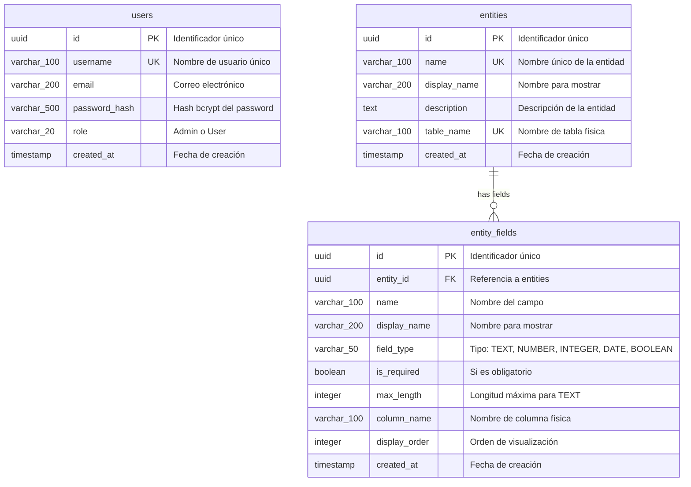
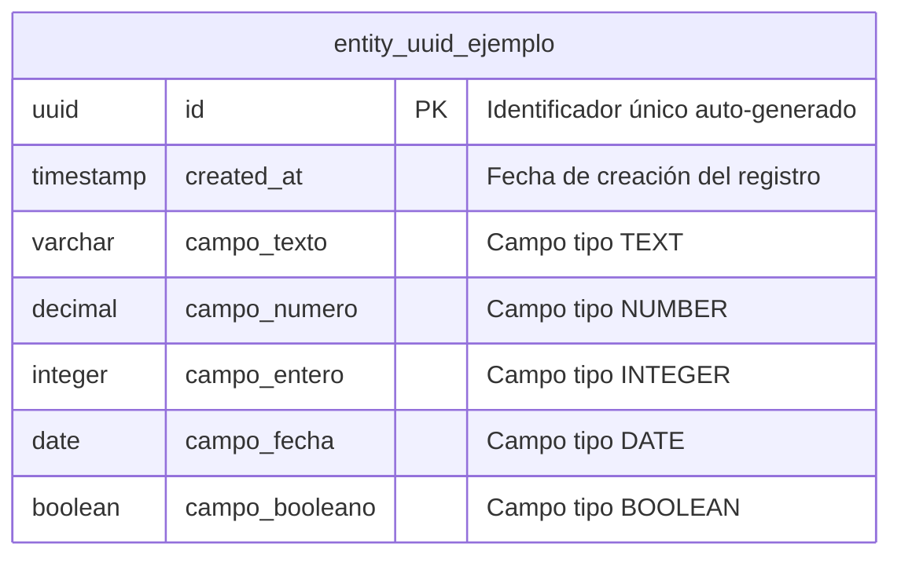

# Modelo de Datos - MetaBuilder

## 1. Diagrama del Modelo de Datos

### 1.1 Diagrama ER (Mermaid)



### 1.2 Diagrama de Tablas Dinámicas



---

## 2. Descripción de Entidades Principales

### 2.1 Tabla: `users`

**Propósito**: Almacena los usuarios del sistema para autenticación y autorización.

| Columna | Tipo | Nullable | Default | Descripción | Restricciones |
|---------|------|----------|---------|-------------|---------------|
| `id` | UUID | NO | `gen_random_uuid()` | Identificador único | PK |
| `username` | VARCHAR(100) | NO | - | Nombre de usuario | UNIQUE |
| `email` | VARCHAR(200) | NO | - | Correo electrónico | - |
| `password_hash` | VARCHAR(500) | NO | - | Hash bcrypt del password | - |
| `role` | VARCHAR(20) | NO | - | Rol del usuario | CHECK (role IN ('Admin', 'User')) |
| `created_at` | TIMESTAMP | NO | `CURRENT_TIMESTAMP` | Fecha de creación | - |

**Índices**:
- `idx_users_username` en `username` (implícito por UNIQUE)
- `idx_users_role` en `role`

**Ejemplo de registro**:
```json
{
  "id": "550e8400-e29b-41d4-a716-446655440000",
  "username": "admin",
  "email": "admin@metabuilder.com",
  "password_hash": "$2b$12$...",
  "role": "Admin",
  "created_at": "2026-01-24T10:00:00Z"
}
```

---

### 2.2 Tabla: `entities`

**Propósito**: Define las entidades de negocio que los usuarios pueden crear dinámicamente.

| Columna | Tipo | Nullable | Default | Descripción | Restricciones |
|---------|------|----------|---------|-------------|---------------|
| `id` | UUID | NO | `gen_random_uuid()` | Identificador único | PK |
| `name` | VARCHAR(100) | NO | - | Nombre interno (snake_case) | UNIQUE |
| `display_name` | VARCHAR(200) | NO | - | Nombre para mostrar en UI | - |
| `description` | TEXT | SÍ | NULL | Descripción opcional | - |
| `table_name` | VARCHAR(100) | NO | - | Nombre de tabla física (entity_{id}) | UNIQUE |
| `created_at` | TIMESTAMP | NO | `CURRENT_TIMESTAMP` | Fecha de creación | - |

**Índices**:
- `idx_entities_name` en `name`
- `idx_entities_table_name` en `table_name`

**Ejemplo de registro**:
```json
{
  "id": "a1b2c3d4-e5f6-7890-abcd-ef1234567890",
  "name": "productos",
  "display_name": "Productos",
  "description": "Catálogo de productos de la empresa",
  "table_name": "entity_a1b2c3d4e5f6",
  "created_at": "2026-01-24T10:30:00Z"
}
```

---

### 2.3 Tabla: `entity_fields`

**Propósito**: Define los campos de cada entidad, con su tipo y configuración.

| Columna | Tipo | Nullable | Default | Descripción | Restricciones |
|---------|------|----------|---------|-------------|---------------|
| `id` | UUID | NO | `gen_random_uuid()` | Identificador único | PK |
| `entity_id` | UUID | NO | - | Referencia a la entidad | FK → entities(id) ON DELETE CASCADE |
| `name` | VARCHAR(100) | NO | - | Nombre interno del campo | UNIQUE(entity_id, name) |
| `display_name` | VARCHAR(200) | NO | - | Nombre para mostrar | - |
| `field_type` | VARCHAR(50) | NO | - | Tipo de dato | CHECK (field_type IN ('TEXT', 'NUMBER', 'INTEGER', 'DATE', 'BOOLEAN')) |
| `is_required` | BOOLEAN | NO | `false` | Si el campo es obligatorio | - |
| `max_length` | INTEGER | SÍ | NULL | Longitud máxima (solo para TEXT) | - |
| `column_name` | VARCHAR(100) | NO | - | Nombre de columna física | UNIQUE(entity_id, column_name) |
| `display_order` | INTEGER | NO | `0` | Orden de visualización | - |
| `created_at` | TIMESTAMP | NO | `CURRENT_TIMESTAMP` | Fecha de creación | - |

**Índices**:
- `idx_entity_fields_entity_id` en `entity_id`
- `idx_entity_fields_display_order` en `(entity_id, display_order)`

**Ejemplo de registro**:
```json
{
  "id": "f1e2d3c4-b5a6-7890-fedc-ba0987654321",
  "entity_id": "a1b2c3d4-e5f6-7890-abcd-ef1234567890",
  "name": "nombre",
  "display_name": "Nombre del Producto",
  "field_type": "TEXT",
  "is_required": true,
  "max_length": 200,
  "column_name": "nombre",
  "display_order": 1,
  "created_at": "2026-01-24T10:35:00Z"
}
```

---

### 2.4 Tablas Dinámicas: `entity_{uuid}`

**Propósito**: Almacena los datos reales de cada entidad definida por el usuario.

**Estructura base** (siempre presente):

| Columna | Tipo | Nullable | Default | Descripción |
|---------|------|----------|---------|-------------|
| `id` | UUID | NO | `gen_random_uuid()` | Identificador único del registro |
| `created_at` | TIMESTAMP | NO | `CURRENT_TIMESTAMP` | Fecha de creación |

**Columnas dinámicas**: Se agregan según los campos definidos en `entity_fields`.

**Mapeo de tipos**:

| field_type | Tipo PostgreSQL | Ejemplo de valor |
|------------|-----------------|------------------|
| TEXT | VARCHAR(max_length) o TEXT | "Laptop Dell XPS" |
| NUMBER | DECIMAL(10,2) | 1299.99 |
| INTEGER | INTEGER | 42 |
| DATE | DATE | 2026-01-24 |
| BOOLEAN | BOOLEAN | true |

**Ejemplo de tabla generada para entidad "productos"**:

```sql
CREATE TABLE entity_a1b2c3d4e5f6 (
    id UUID PRIMARY KEY DEFAULT gen_random_uuid(),
    created_at TIMESTAMP NOT NULL DEFAULT CURRENT_TIMESTAMP,
    nombre VARCHAR(200) NOT NULL,
    descripcion TEXT,
    precio DECIMAL(10,2),
    stock INTEGER,
    activo BOOLEAN DEFAULT true
);
```

---

## 3. Análisis de Gaps vs Funcionalidad Core

### 3.1 Comparación Schema Actual vs MVP

| Tabla en schema.sql | Requerida para MVP | Acción |
|---------------------|-------------------|--------|
| `users` | ❌ NO existe | **AGREGAR** |
| `entities` | ✅ Existe | Simplificar |
| `entity_fields` | ✅ Existe | Simplificar |
| `field_validations` | ❌ Fuera de scope | Eliminar |
| `entity_relations` | ❌ Fuera de scope | Eliminar |
| `entity_views` | ❌ Fuera de scope | Eliminar |
| `entity_data` | ❌ No usar | Eliminar |
| `entity_relations_data` | ❌ Fuera de scope | Eliminar |
| `audit_log` | ❌ Fuera de scope | Eliminar |
| `entity_data_versions` | ❌ Fuera de scope | Eliminar |
| `error_logs` | ❌ Fuera de scope | Eliminar |
| `user_permissions` | ❌ Fuera de scope | Eliminar |
| `role_entity_permissions` | ❌ Fuera de scope | Eliminar |
| `system_metrics` | ❌ Fuera de scope | Eliminar |

### 3.2 Cambios Sugeridos

#### Agregar: Tabla `users`

**Motivo**: Requerida para autenticación JWT del MVP.

```sql
CREATE TABLE users (
    id UUID PRIMARY KEY DEFAULT gen_random_uuid(),
    username VARCHAR(100) NOT NULL UNIQUE,
    email VARCHAR(200) NOT NULL,
    password_hash VARCHAR(500) NOT NULL,
    role VARCHAR(20) NOT NULL CHECK (role IN ('Admin', 'User')),
    created_at TIMESTAMP NOT NULL DEFAULT CURRENT_TIMESTAMP
);

CREATE INDEX idx_users_username ON users(username);
CREATE INDEX idx_users_role ON users(role);
```

#### Simplificar: Tabla `entities`

**Cambios**:
- Eliminar `updated_at` (no hay soft updates en MVP)
- Eliminar `created_by` (no hay tracking de creador en MVP)
- Eliminar `is_active` (usar hard delete en MVP)

#### Simplificar: Tabla `entity_fields`

**Cambios**:
- Eliminar `is_unique` (validaciones avanzadas fuera de scope)
- Eliminar `default_value` (fuera de scope MVP)

#### Eliminar: Tablas fuera de scope

Las siguientes tablas se eliminarán del schema MVP:
- `field_validations`
- `entity_relations`
- `entity_views`
- `entity_data`
- `entity_relations_data`
- `audit_log`
- `entity_data_versions`
- `error_logs`
- `user_permissions`
- `role_entity_permissions`
- `system_metrics`

---

## 4. Impacto en APIs y Migraciones

### 4.1 Impacto en APIs

| Endpoint | Impacto | Descripción |
|----------|---------|-------------|
| `POST /api/auth/register` | Nuevo | Requiere tabla `users` |
| `POST /api/auth/login` | Nuevo | Requiere tabla `users` |
| `POST /api/metadata/entities` | Sin cambio | Ya usa campos simplificados |
| `POST /api/metadata/entities/{id}/fields` | Sin cambio | Ya usa campos simplificados |
| APIs de relaciones | Eliminadas | No existen en MVP |
| APIs de vistas | Eliminadas | No existen en MVP |
| APIs de auditoría | Eliminadas | No existen en MVP |

### 4.2 Estrategia de Migraciones

**Migración inicial** (Alembic):

1. Crear tabla `users`
2. Crear tabla `entities` (simplificada)
3. Crear tabla `entity_fields` (simplificada)
4. Crear función para tablas dinámicas

**Migraciones futuras** (post-MVP):

1. Agregar `field_validations`
2. Agregar `entity_relations`
3. Agregar tablas de auditoría

---

## 5. Diccionario de Datos

### 5.1 Tabla: users

| Campo | Tipo | PK | FK | UK | NN | Default | Check | Descripción |
|-------|------|:--:|:--:|:--:|:--:|---------|-------|-------------|
| id | UUID | ✓ | | | ✓ | gen_random_uuid() | | Identificador único |
| username | VARCHAR(100) | | | ✓ | ✓ | | | Nombre de usuario |
| email | VARCHAR(200) | | | | ✓ | | | Correo electrónico |
| password_hash | VARCHAR(500) | | | | ✓ | | | Hash bcrypt |
| role | VARCHAR(20) | | | | ✓ | | IN ('Admin', 'User') | Rol del usuario |
| created_at | TIMESTAMP | | | | ✓ | CURRENT_TIMESTAMP | | Fecha de creación |

### 5.2 Tabla: entities

| Campo | Tipo | PK | FK | UK | NN | Default | Check | Descripción |
|-------|------|:--:|:--:|:--:|:--:|---------|-------|-------------|
| id | UUID | ✓ | | | ✓ | gen_random_uuid() | | Identificador único |
| name | VARCHAR(100) | | | ✓ | ✓ | | | Nombre interno |
| display_name | VARCHAR(200) | | | | ✓ | | | Nombre para mostrar |
| description | TEXT | | | | | NULL | | Descripción |
| table_name | VARCHAR(100) | | | ✓ | ✓ | | | Nombre de tabla física |
| created_at | TIMESTAMP | | | | ✓ | CURRENT_TIMESTAMP | | Fecha de creación |

### 5.3 Tabla: entity_fields

| Campo | Tipo | PK | FK | UK | NN | Default | Check | Descripción |
|-------|------|:--:|:--:|:--:|:--:|---------|-------|-------------|
| id | UUID | ✓ | | | ✓ | gen_random_uuid() | | Identificador único |
| entity_id | UUID | | ✓ | | ✓ | | | FK a entities |
| name | VARCHAR(100) | | | (1) | ✓ | | | Nombre del campo |
| display_name | VARCHAR(200) | | | | ✓ | | | Nombre para mostrar |
| field_type | VARCHAR(50) | | | | ✓ | | IN ('TEXT', 'NUMBER', 'INTEGER', 'DATE', 'BOOLEAN') | Tipo de dato |
| is_required | BOOLEAN | | | | ✓ | false | | Si es obligatorio |
| max_length | INTEGER | | | | | NULL | | Longitud máxima |
| column_name | VARCHAR(100) | | | (2) | ✓ | | | Nombre de columna |
| display_order | INTEGER | | | | ✓ | 0 | | Orden de visualización |
| created_at | TIMESTAMP | | | | ✓ | CURRENT_TIMESTAMP | | Fecha de creación |

**(1)** UNIQUE(entity_id, name)  
**(2)** UNIQUE(entity_id, column_name)

---

## 6. Tipos de Datos y Validaciones

### 6.1 Mapeo de Tipos

| field_type | PostgreSQL | Python | TypeScript | Validación |
|------------|------------|--------|------------|------------|
| TEXT | VARCHAR(n) / TEXT | str | string | max_length si aplica |
| NUMBER | DECIMAL(10,2) | Decimal | number | Numérico con decimales |
| INTEGER | INTEGER | int | number | Entero sin decimales |
| DATE | DATE | date | string (ISO) | Formato YYYY-MM-DD |
| BOOLEAN | BOOLEAN | bool | boolean | true/false |

### 6.2 Validaciones por Tipo

| Tipo | Validación | Mensaje de error |
|------|------------|------------------|
| TEXT | `len(value) <= max_length` | "Excede longitud máxima de {max_length}" |
| NUMBER | `isinstance(value, (int, float, Decimal))` | "Debe ser un número" |
| INTEGER | `isinstance(value, int)` | "Debe ser un número entero" |
| DATE | Formato ISO válido | "Formato de fecha inválido" |
| BOOLEAN | `isinstance(value, bool)` | "Debe ser verdadero o falso" |
| Todos | `is_required and value is not None` | "Este campo es requerido" |

---

## 7. Schema SQL Simplificado para MVP

Ver archivo completo: [schema-mvp.sql](./schema-mvp.sql)

```sql
-- ============================================
-- ESQUEMA DE BASE DE DATOS - MVP
-- MetaBuilder - Sistema Low-Code Platform
-- ============================================

-- Extensiones necesarias
CREATE EXTENSION IF NOT EXISTS "pgcrypto";

-- ============================================
-- TABLA DE USUARIOS
-- ============================================

CREATE TABLE users (
    id UUID PRIMARY KEY DEFAULT gen_random_uuid(),
    username VARCHAR(100) NOT NULL UNIQUE,
    email VARCHAR(200) NOT NULL,
    password_hash VARCHAR(500) NOT NULL,
    role VARCHAR(20) NOT NULL CHECK (role IN ('Admin', 'User')),
    created_at TIMESTAMP NOT NULL DEFAULT CURRENT_TIMESTAMP
);

CREATE INDEX idx_users_username ON users(username);
CREATE INDEX idx_users_role ON users(role);

-- ============================================
-- TABLAS DE METADATOS
-- ============================================

CREATE TABLE entities (
    id UUID PRIMARY KEY DEFAULT gen_random_uuid(),
    name VARCHAR(100) NOT NULL UNIQUE,
    display_name VARCHAR(200) NOT NULL,
    description TEXT,
    table_name VARCHAR(100) NOT NULL UNIQUE,
    created_at TIMESTAMP NOT NULL DEFAULT CURRENT_TIMESTAMP
);

CREATE INDEX idx_entities_name ON entities(name);

CREATE TABLE entity_fields (
    id UUID PRIMARY KEY DEFAULT gen_random_uuid(),
    entity_id UUID NOT NULL REFERENCES entities(id) ON DELETE CASCADE,
    name VARCHAR(100) NOT NULL,
    display_name VARCHAR(200) NOT NULL,
    field_type VARCHAR(50) NOT NULL CHECK (field_type IN ('TEXT', 'NUMBER', 'INTEGER', 'DATE', 'BOOLEAN')),
    is_required BOOLEAN NOT NULL DEFAULT false,
    max_length INTEGER,
    column_name VARCHAR(100) NOT NULL,
    display_order INTEGER NOT NULL DEFAULT 0,
    created_at TIMESTAMP NOT NULL DEFAULT CURRENT_TIMESTAMP,
    UNIQUE(entity_id, name),
    UNIQUE(entity_id, column_name)
);

CREATE INDEX idx_entity_fields_entity_id ON entity_fields(entity_id);
CREATE INDEX idx_entity_fields_display_order ON entity_fields(entity_id, display_order);

-- ============================================
-- COMENTARIOS
-- ============================================

COMMENT ON TABLE users IS 'Usuarios del sistema para autenticación';
COMMENT ON TABLE entities IS 'Definición de entidades de negocio dinámicas';
COMMENT ON TABLE entity_fields IS 'Campos de cada entidad con tipo y configuración';
```

---

*Última actualización: Enero 2026*
