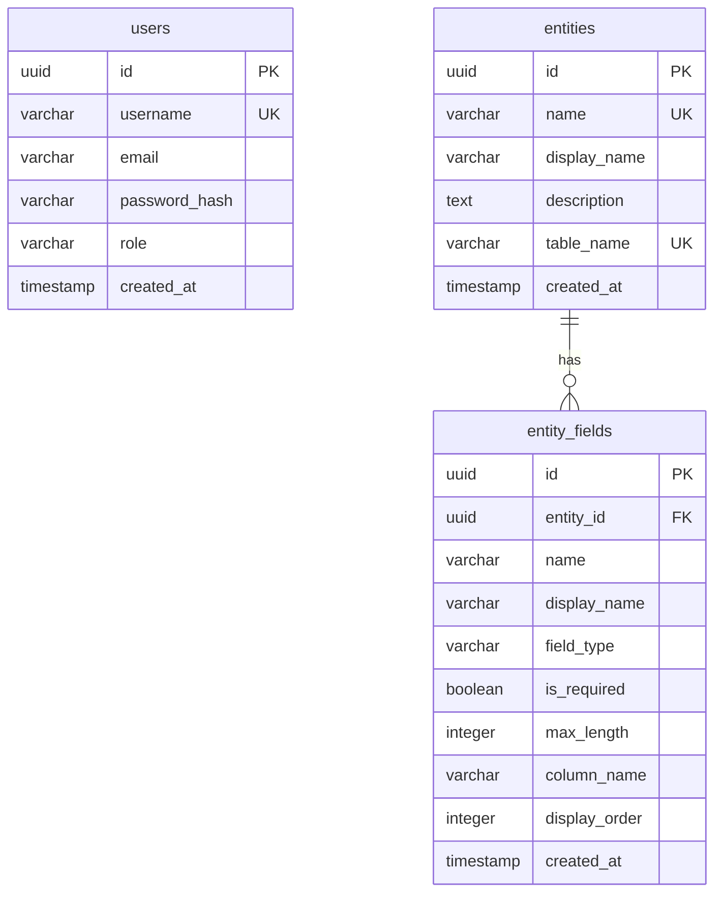

# MetaBuilder - Documentación del Proyecto

## Índice

0. [Ficha del proyecto](#0-ficha-del-proyecto)
1. [Descripción general del producto](#1-descripción-general-del-producto)
2. [Arquitectura del sistema](#2-arquitectura-del-sistema)
3. [Modelo de datos](#3-modelo-de-datos)
4. [Especificación de la API](#4-especificación-de-la-api)
5. [Historias de usuario](#5-historias-de-usuario)
6. [Tickets de trabajo](#6-tickets-de-trabajo)
7. [Pull requests](#7-pull-requests)

---

## 0. Ficha del proyecto

### **0.1. Tu nombre completo:**

Gustavo

### **0.2. Nombre del proyecto:**

MetaBuilder - Sistema Low-Code Platform

### **0.3. Descripción breve del proyecto:**

MetaBuilder es una plataforma administrativa basada en metadatos que permite a los administradores definir entidades de negocio dinámicamente sin necesidad de modificar código. Los usuarios finales pueden crear, leer, actualizar y eliminar registros de estas entidades a través de interfaces generadas automáticamente.

**Características principales:**
- Definición dinámica de entidades y campos desde una interfaz administrativa
- CRUD genérico que funciona para cualquier entidad configurada
- Generación automática de tablas en PostgreSQL basadas en metadatos
- Autenticación JWT con roles (Admin/User)
- Frontend React con formularios y listados dinámicos

### **0.4. URL del proyecto:**

> Pendiente de deploy. Se desplegará en Railway o Render.
> URL provisional: `https://metabuilder-api.railway.app` (backend) / `https://metabuilder.vercel.app` (frontend)

### **0.5. URL o archivo comprimido del repositorio**

> Repositorio GitHub: [Pendiente por definir URL final]
> Acceso: Público

---

## 1. Descripción general del producto

📄 **Documento completo:** [2-descripcion-producto/descripcion-producto.md](./2-descripcion-producto/descripcion-producto.md)

### **1.1. Objetivo:**

Proporcionar una plataforma que permita a usuarios no técnicos definir estructuras de datos (entidades) y gestionar información sin necesidad de desarrollo de código, reduciendo tiempos y costos de desarrollo de aplicaciones administrativas.

### **1.2. Características y funcionalidades principales:**

| Funcionalidad | Descripción | Rol |
|---------------|-------------|-----|
| Gestión de entidades | Crear, editar, eliminar entidades con nombre y descripción | Admin |
| Gestión de campos | Agregar campos con tipos (TEXT, NUMBER, INTEGER, DATE, BOOLEAN) | Admin |
| CRUD dinámico | Operaciones sobre registros de cualquier entidad | Admin/User |
| Autenticación JWT | Login seguro con tokens de 24 horas | Todos |
| Formularios dinámicos | Generación automática de formularios según metadatos | Admin/User |
| Listados dinámicos | Tablas con paginación generadas según metadatos | Admin/User |

### **1.3. Diseño y experiencia de usuario:**

> Las capturas de pantalla y videotutorial se agregarán una vez implementado el frontend.

### **1.4. Instrucciones de instalación:**

Ver sección completa en [2-descripcion-producto/descripcion-producto.md](./2-descripcion-producto/descripcion-producto.md#instrucciones-de-instalación)

---

## 2. Arquitectura del Sistema

📄 **Documento completo:** [3-arquitectura/arquitectura.md](./3-arquitectura/arquitectura.md)

### **2.1. Diagrama de arquitectura:**

```
┌─────────────────────────────────────────┐
│         Frontend (React + TS)           │
│  - Admin de entidades                   │
│  - CRUD dinámico                        │
└─────────────────┬───────────────────────┘
                  │ HTTP/REST + JWT
┌─────────────────▼───────────────────────┐
│      API Layer (FastAPI)                │
│  - metadata_router                      │
│  - crud_router                          │
│  - auth_router                          │
└─────────────────┬───────────────────────┘
                  │
┌─────────────────▼───────────────────────┐
│    Application Layer (Services)         │
│  - MetadataService                      │
│  - DynamicCrudService                   │
│  - AuthService (JWT)                    │
└─────────────────┬───────────────────────┘
                  │
┌─────────────────▼───────────────────────┐
│      Domain Layer (Entities)            │
│  - Entity, Field, ValidationRule        │
│  - Interfaces/Protocols                 │
└─────────────────┬───────────────────────┘
                  │
┌─────────────────▼───────────────────────┐
│    Infrastructure Layer (Data)          │
│  - MetadataRepository (SQLAlchemy ORM)  │
│  - DynamicDataRepository (SQLAlchemy Core)
│  - TableManager (DDL dinámico)          │
└─────────────────┬───────────────────────┘
                  │
┌─────────────────▼───────────────────────┐
│         PostgreSQL Database             │
└─────────────────────────────────────────┘
```

### **2.2. Descripción de componentes principales:**

| Componente | Tecnología | Responsabilidad |
|------------|------------|-----------------|
| Frontend | React 18 + TypeScript + Vite | UI dinámica, formularios, listados |
| API Layer | FastAPI | Endpoints REST, validación, auth middleware |
| Application Layer | Python Services | Lógica de negocio, orquestación |
| Domain Layer | Python Entities | Modelos de dominio, interfaces |
| Infrastructure | SQLAlchemy + Alembic | Acceso a datos, migraciones |
| Database | PostgreSQL 15+ | Almacenamiento de metadatos y datos |

### **2.3. Descripción de alto nivel del proyecto y estructura de ficheros**

Ver estructura completa en [3-arquitectura/arquitectura.md](./3-arquitectura/arquitectura.md#estructura-de-ficheros)

### **2.4. Infraestructura y despliegue**

- **Desarrollo:** Docker Compose (PostgreSQL local)
- **Producción:** Railway (Backend + PostgreSQL) / Vercel (Frontend)
- **CI/CD:** GitHub Actions (build, test, deploy)

### **2.5. Seguridad**

- Autenticación JWT con bcrypt para passwords
- Autorización por roles (Admin/User)
- Prevención de SQL Injection mediante parámetros SQLAlchemy
- CORS configurado para dominios permitidos

### **2.6. Tests**

- Smoke tests básicos para endpoints principales
- Tests de integración para flujo CRUD completo

---

## 3. Modelo de Datos

📄 **Documento completo:** [4-modelo-datos/modelo-datos.md](./4-modelo-datos/modelo-datos.md)

### **3.1. Diagrama del modelo de datos:**



### **3.2. Descripción de entidades principales:**

| Entidad | Descripción | Campos clave |
|---------|-------------|--------------|
| users | Usuarios del sistema | username, password_hash, role |
| entities | Definición de entidades dinámicas | name, display_name, table_name |
| entity_fields | Campos de cada entidad | name, field_type, is_required |

---

## 4. Especificación de la API

📄 **Documento completo:** [5-especificacion-api/api-specification.md](./5-especificacion-api/api-specification.md)

### Endpoints principales (resumen)

#### Auth API
```yaml
POST /api/auth/register    # Registrar usuario
POST /api/auth/login       # Login y obtener JWT
```

#### Metadata API (Admin)
```yaml
GET    /api/metadata/entities              # Listar entidades
GET    /api/metadata/entities/{id}         # Obtener entidad con campos
POST   /api/metadata/entities              # Crear entidad
PUT    /api/metadata/entities/{id}         # Actualizar entidad
DELETE /api/metadata/entities/{id}         # Eliminar entidad
POST   /api/metadata/entities/{id}/fields  # Agregar campo
DELETE /api/metadata/entities/{id}/fields/{fieldId}  # Eliminar campo
```

#### CRUD Dinámico API
```yaml
GET    /api/entities/{entityId}/records              # Listar registros
GET    /api/entities/{entityId}/records/{recordId}   # Obtener registro
POST   /api/entities/{entityId}/records              # Crear registro
PUT    /api/entities/{entityId}/records/{recordId}   # Actualizar registro
DELETE /api/entities/{entityId}/records/{recordId}   # Eliminar registro
```

---

## 5. Historias de Usuario

📄 **Documento completo:** [6-historias-usuario/historias-usuario.md](./6-historias-usuario/historias-usuario.md)

### Resumen de épicas e historias

| Épica | Historias | Horas | Descripción |
|-------|-----------|-------|-------------|
| EP-01: Setup | US-001 a US-005 | 2h | Configuración inicial del proyecto |
| EP-02: Auth | US-006 a US-009 | 2h | Sistema de autenticación JWT |
| EP-03: Metadatos | US-010 a US-017 | 6h | Gestión de entidades y campos |
| EP-04: CRUD | US-018 a US-024 | 8h | Motor de CRUD dinámico |
| EP-05: Frontend Admin | US-025 a US-030 | 4h | UI de administración |
| EP-06: Frontend CRUD | US-031 a US-037 | 6h | UI de CRUD dinámico |
| EP-07: Deploy | US-038 a US-041 | 2h | Despliegue y documentación |
| **Total** | **41 historias** | **30h** | |

---

## 6. Tickets de Trabajo

📄 **Documento completo:** [7-tickets-trabajo/tickets-trabajo.md](./7-tickets-trabajo/tickets-trabajo.md)

### Distribución por rol

| Rol | Prefijo | Cantidad | Responsabilidad |
|-----|---------|----------|-----------------|
| Backend | TK-BE-### | ~25 | APIs, servicios, repositorios |
| Frontend | TK-FE-### | ~20 | Componentes React, hooks, pages |
| DBA | TK-DBA-### | ~8 | Migraciones, schema, índices |
| DevOps | TK-INFRA-### | ~5 | Docker, CI/CD, deploy |
| QA | TK-QA-### | ~5 | Tests, validaciones |
| PM | TK-PM-### | ~3 | Criterios, priorización |

---

## 7. Pull Requests

📄 **Documento completo:** [8-pull-requests/pull-requests.md](./8-pull-requests/pull-requests.md)

### PRs planificados (resumen)

| PR | Título | Épica | Archivos principales |
|----|--------|-------|---------------------|
| PR-001 | Setup inicial del proyecto | EP-01 | Estructura, Docker, configs |
| PR-002 | Sistema de autenticación JWT | EP-02 | auth_router, auth_service, User model |
| PR-003 | API de metadatos | EP-03 | metadata_router, metadata_service |
| PR-004 | Motor CRUD dinámico | EP-04 | crud_router, query_builder |
| PR-005 | Frontend - Auth y Layout | EP-05 | Login, Layout, AuthContext |
| PR-006 | Frontend - Admin entidades | EP-05 | EntityBuilder, FieldManager |
| PR-007 | Frontend - CRUD dinámico | EP-06 | DynamicList, DynamicForm |
| PR-008 | Deploy y documentación | EP-07 | Dockerfile, README, seeds |

---

## Pendientes por Definir (PpD)

| ID | Pregunta | Contexto | Estado |
|----|----------|----------|--------|
| PpD-001 | ¿Límite máximo de registros por página? | Paginación API | Sugerido: 100 |
| PpD-002 | ¿Requisitos mínimos de contraseña? | Registro de usuarios | Sugerido: 8 caracteres |
| PpD-003 | ¿Límite de campos por entidad? | Gestión de metadatos | Sugerido: 50 |
| PpD-004 | ¿Nombres de entidad/campo prohibidos? | Validaciones | Sugerido: id, created_at |
| PpD-005 | ¿Formato de nombres de entidad? | Validaciones | Sugerido: snake_case |

---

## Roadmap

### MVP (v0.1) - 30 horas
- Gestión de entidades y campos
- CRUD dinámico básico
- Auth JWT simple
- Frontend funcional
- Deploy en Railway

### v1.0 - Post-MVP
- Relaciones entre entidades (1-N, N-N)
- Validaciones avanzadas (regex, custom rules)
- Filtros y búsqueda avanzada
- Soft deletes

### v2.0 - Futuro
- Sistema de auditoría completo
- Rollback de cambios
- Reportes y métricas
- Vistas configurables
- Webhooks y triggers

---

## Próximos Pasos (Acción Inmediata)

1. **Revisar y aprobar** este backlog con el equipo
2. **Configurar repositorio** GitHub con estructura de carpetas
3. **Iniciar Sprint 1** con épicas EP-01 y EP-02
4. **Crear board** en GitHub Projects con tickets

---

*Última actualización: Enero 2026*
*Versión del documento: 1.0*
